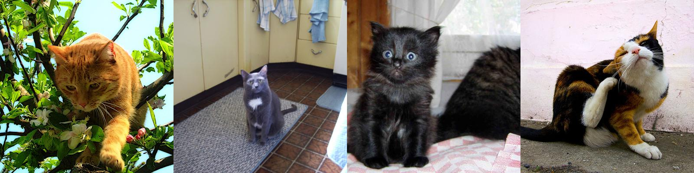

In this exercise we will be making a photo mosaic. You know, one of those pictures that is made up out of many smaller pictures. For the purpose of this exercise we will be using a dataset of cat pictures from Kaggle.



Let us say we have the following settings:

``` {.toml file=config.toml}
data_path = "./data"
image_path = "./data/cats"

# Image no. 5019 is really nice
target_id = 5019
# The target will consists of 100x100 smaller thumbnails
target_res = [100, 100]
# Each thumbnail has a 50x50 resolution
thumb_res = [50, 50]
```

We can load this configuration using the `toml` library.

``` {.python #imports}
import toml
```

``` {.python #load-config}
def list_images(path: Path) -> Iterator[Path]:
    return path.glob("**/*.jpg")
```

``` {.python #load-config}
config = toml.load("config.toml")
target_id = config["target_id"]
target_res = config["target_res"]
thumb_res = config["thumb_res"]
data_path = Path(config["data_path"])
image_paths = list_images(Path(config["image_path"]))
```

To construct the program we need to import several standard Python utilities:

``` {.python file=mosaic.py}
<<imports>>

<<functions>>
```

``` {.python #imports}
from collections.abc import Iterator
from functools import partial
from pathlib import Path
from io import BytesIO
```

# Pre-processing
We use Pillow to manipulate images.

``` {.python #imports}
from PIL import Image, ImageOps
```

For example, to create the above series of cat images:

``` {.python #repl eval=1}
<<imports>>
<<load-config>>
collage = Image.new("RGB", (1600, 400))
for i in range(4):
    path = image_paths[target_id + i]
    square_img = ImageOps.fit(Image.open(path), (400, 400))
    collage.paste(square_img, (i*400, 0))
collage.save("fig/collage.jpg")
```

To make the mosaic, we need to cut every single image in the data set to the same size, and store them somewhere so that we don't ever have to do that again. We will store our processed data into an HDF5 file.

``` {.python #imports}
import h5py as h5
```

To shrink an image we use `ImageOps.fit` from Pillow.

``` {.python #pre-processing}
def process(img: Image.Image) -> Image.Image:
    return ImageOps.fit(img, thumb_res)
```

We can store the images to HDF5, but it will be more efficient if we first compress it as a JPEG.

``` {.python #pre-processing}
def encode_to_jpeg(img: Image.Image) -> bytes:
    f = BytesIO()
    img.save(f, "jpeg")
    return f.getbuffer()
```

Our dataset is small enough that we may dump all images to HDF5 at once.

``` {.python #pre-processing}
def save_all(path: Path, jpgs: Iterator[bytes]) -> None:
    with h5.File(path, "w") as out:
        for n, jpg in enumerate(jpgs):
            dataset = out.create_dataset(
                f"{n:06}", data=np.frombuffer(jpg, dtype='B'))
```

We can put this together now.

``` {.python}
images = map(lambda x: process(Image.open(x)), image_paths)
jpegs = map(images, encode_to_jpeg)
save_all(data_path / "thumbnails.h5", jpegs)
```

## Exercises

1. Consider that you may want to put this workflow into a Snakefile, why is it convenient to have the configuration stored in `config.toml`, and not inside the Python script?
2. The pre-processing takes about 1m30 on my machine. That is doable but it would be much less annoying if we could cut it down to several tens of seconds. What abstraction would you choose, would you use Dask delayed, bags or go directly for Snakemake? Why do you choose one over the other? Is it still feasible to dump all thumbnails into a single HDF5 file?
3. Parallelize the pre-processing.

# Matching pixels
The next part is to match pixels in our target image with images in the data set. Since we saved everything to a HDF5 file, we can load our thumbnails from there now.

``` {.python #matching}
with h5.File(data_path / "thumbnails.h5", "r") as f:
    images = [Image.open(BytesIO(f[n][:]), formats=["jpeg"]) for n in f]
```

``` {.python #matching}
thumbs_rgb = np.array([ImageStat.Stat(img).mean for img in images])
target_img = ImageOps.fit(Image.open(image_paths[target_id]), target_res)
r, g, b = (np.array(target_img.getdata(band)) for band in range(3))
target_rgb = np.c_[r, g, b]
```

## Nearest neighbour
We may now compute the distance (in color space) from each pixel in the target image to the mean value in all of the thumbnails.

``` {.python #matching}
dist = ((target_rgb[:,None,:] - thumbs_rgb[None,:,:])**2).sum(axis=2)
```

There are now several strategies to follow. One option is to take the "best" possible match for each pixel. We will call this the *nearest neighbour* approach:

``` {.python #matching}
match = np.argmin(dist, axis=0)
print("Unique images used in nearest neighbour approach: {}" \
      .format(np.unique(matches).shape[0]))
np.savetxt(
    data_path / "matches_nearest.tab",
    matches.reshape(target_res),
    fmt="%d")
```

Note that in our naive implementation of nearest neighbour finding, we computed the distance between every pair of pixel values, leading to order $O(nm)$ scaling, where $n$ is the amount of tiles in the target mosaic and $m$ is the amount of pixels per tile. There are several options to parallelize this, or find other speed-ups. In particular KD-trees come to mind (see `scipy.spatial` for an implementation of KD-trees).

## Optimal transport
The result from using nearest neighbour matching may not be what you're looking for when making a photo mosaic. After all, wouldn't it be cool if we could place every cat image in our data set once?

It turns out that this is one of the hardest problems in computer science and is known by many names. Though not all identical, all these problems are related:
- Monge's (Ampère and Kantorovich can also be found in naming this) problem: suppose you have a number of mines in several places, and refineries in other places. You want to move ore to all the refineries in such a way that the total mass transport is minimized.
- Stable Mariage problem: suppose you have $n$ men and $n$ women (all straight, this problem was first stated somewhere in the 1950ies) and want to create $n$ couples, such that no man desires another's wife that also desires that man over her own spouse.
- Optimal Mariage problem: in the previous setting can you find the solution that makes everyone the happiest globally?
- Find the least "costly" mapping from one probability distribution to another.

These problems generally belong to the topic of *optimal transport*. There is a nice Python library, Python Optimal Transport, or `pot` for short, that implements many algorithms for solving optimal transport problems.

``` {.python #imports}
import ot
```

``` {.python #matching}
n = len(thumbs_rgb)
m = len(target_rgb)
# This does the same as our previous computation of distances
M = ot.dist(thumbs_rgb, target_rgb)
M /= M.max()
G0 = ot.emd(np.ones((n,))/n, np.ones((m,))/m, M, numItermax=10**6)
```

``` {.python #matching}
matches = np.argmax(G0, axis=0)
print("Unique images used in optimal transport approach: {}" \
      .format(np.unique(matches).shape[0]))
np.savetxt(
    data_path / "matches_unique.tab",
    matches.reshape(target_res),
    fmt="%d")
```

# Construct mosaic

``` {.python #mosaic}
with h5.File(data_path / "tiny_imgs.h5", "r") as f:
    imgs = [Image.open(BytesIO(f[n][:]), formats=["jpeg"]) for n in f]
    
matches_nearest = np.loadtxt(data_path / "matches_nearest.tab", dtype=int)
matches_unique = np.loadtxt(data_path / "matches_unique.tab", dtype=int)

ys, xs = np.indices(target_res)

mosaic = Image.new("RGB", (target_res[0]*thumb_res[0], target_res[1]*thumb_res[1]))

for (x, y, m) in zip(xs.flat, ys.flat, matches_unique.flat):
    mosaic.paste(imgs[m], (x*thumb_res[0], y*thumb_res[1]))

mosaic.save("mosaic_unique.jpg")

for (x, y, m) in zip(xs.flat, ys.flat, matches_nearest.flat):
    mosaic.paste(imgs[m], (x*thumb_res[0], y*thumb_res[1]))

mosaic.save("mosaic_nearest.jpg")
```
